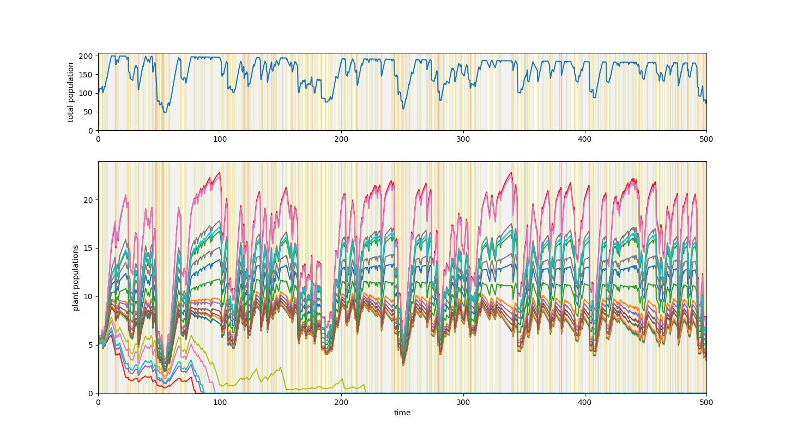

# Mathematical Modeling Competition 2023 Problem A #
We introduce a mathematical model based on both a classic population dynamics set of differential equations, while inserting stochastic elements to better represent natural phenomena in order to determine the effect of localized biodiversity on drought resistance in plant communities. Beginning with a competitive Lotka-Volterra model of populatin dynamics, we enrich the model with both stochastic and deterministic processes to account for the ffects of the drought cycle, pollution, and habitat loss. We hypothesize that our model will reflect a positive relationship between biodiversity of a plant community and its ability to weather droughts.

<embed src="/summary.pdf" type="application/pdf"/>
<object data="https://github.com/kylesayrs/MCM_2023/blob/master/summary.pdf" type="application/pdf" width="700px" height="700px">
    <embed src="https://github.com/kylesayrs/MCM_2023/blob/master/summary.pdf">
        
This browser does not support PDFs. Please download the PDF to view it: <a href="https://github.com/kylesayrs/MCM_2023/blob/master/summary.pdf">Download PDF</a>.

    </embed>
</object>
